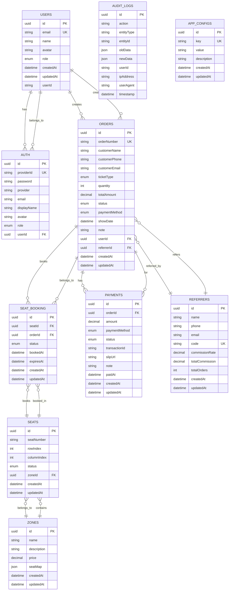

# 🎫 ER Diagram - Ticket Booking System

## 📊 Entity Relationship Diagram

## 🔗 Relationship Details

### 1. **Users ↔ Auth (1:N)**
- One User can have multiple Auth records (different providers)
- Each Auth record belongs to one User

### 2. **Users ↔ Orders (1:N)**
- One User can create multiple Orders
- Each Order belongs to one User

### 3. **Zones ↔ Seats (1:N)**
- One Zone contains multiple Seats
- Each Seat belongs to one Zone

### 4. **Orders ↔ Seat Booking (1:N)**
- One Order can book multiple Seats
- Each Seat Booking belongs to one Order

### 5. **Seats ↔ Seat Booking (1:N)**
- One Seat can have multiple Bookings (different times)
- Each Booking is for one Seat

### 6. **Orders ↔ Payments (1:N)**
- One Order can have multiple Payments (partial payments)
- Each Payment belongs to one Order

### 7. **Referrers ↔ Orders (1:N)**
- One Referrer can refer multiple Orders
- Each Order can be referred by one Referrer

## 📋 Entity Descriptions

### **Users**
- Core user information
- Manages user profiles and authentication

### **Auth**
- Authentication records for different providers
- Supports manual, Google, Facebook, LINE login

### **Zones**
- Seating zones (Ringside, VIP, General, etc.)
- Contains pricing and seat layout information

### **Seats**
- Individual seats within zones
- Tracks seat numbers and positions

### **Orders**
- Ticket booking orders
- Contains customer and booking information

### **Seat Booking**
- Junction table for Orders and Seats
- Tracks booking status and timing

### **Payments**
- Payment records for orders
- Supports multiple payment methods

### **Referrers**
- Referral system for commission tracking
- Tracks referrer performance

### **Audit Logs**
- System activity tracking
- Records all important changes

### **App Configs**
- System configuration settings
- Key-value pairs for app settings

## 🎯 Key Features

### **Multi-tenancy Support**
- Users can have multiple auth methods
- Orders can have multiple seat bookings
- Payments can be split across multiple transactions

### **Flexible Booking System**
- Seats can be booked temporarily
- Bookings have expiration times
- Status tracking throughout the process

### **Commission System**
- Referrers track total orders and commissions
- Automatic commission calculation

### **Audit Trail**
- Complete system activity logging
- Data change tracking for compliance

### **Configurable System**
- App settings stored in database
- Easy configuration management
