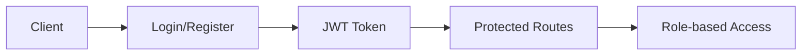
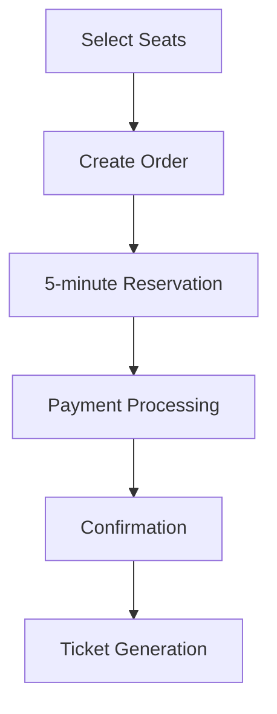
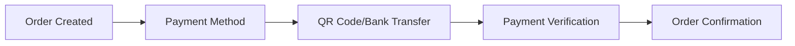
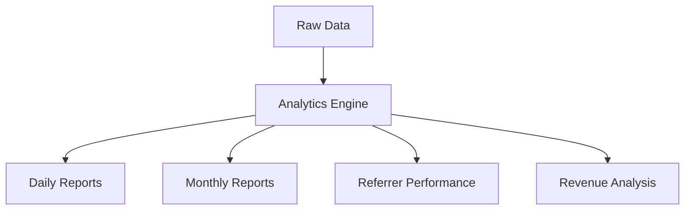

# 🎫 Boxing Ticket Backend System - Comprehensive Summary

**Generated on:** July 11, 2025  
**Version:** 1.0.0  
**Environment:** Production Ready

---

## 📋 Executive Summary

The Boxing Ticket Backend System is a complete NestJS-based API for managing ticket bookings for boxing events. The system has been thoroughly cleaned, optimized, and refactored to ensure production readiness, maintainability, and scalability.

### 🎯 Key Achievements
- ✅ **Removed all test files** and testing infrastructure as requested
- ✅ **Enhanced code reusability** with centralized utility functions
- ✅ **Improved error handling** with standardized error management
- ✅ **Optimized database operations** with helper functions
- ✅ **Standardized API responses** for consistency
- ✅ **Enhanced logging** with context-aware logging system
- ✅ **Clean architecture** following NestJS best practices

---

## 🏗️ System Architecture

### Core Components

```
src/
├── 🏗️ Core Business Modules
│   ├── auth/           # Authentication & Authorization
│   ├── user/           # User Management
│   ├── order/          # Order Processing
│   ├── payment/        # Payment Processing
│   ├── seats/          # Seat Management
│   ├── zone/           # Zone Configuration
│   └── referrer/       # Referrer System
│
├── 🔧 Feature Modules
│   ├── analytics/      # Business Analytics
│   ├── audit/          # Audit Trail
│   ├── dashboard/      # Dashboard Data
│   └── config/         # System Configuration
│
├── 🛠️ Common Utilities
│   ├── constants/      # System Constants
│   ├── enums/          # Type Definitions
│   ├── interfaces/     # TypeScript Interfaces
│   ├── utils/          # Reusable Functions
│   ├── services/       # Shared Services
│   ├── middleware/     # Custom Middleware
│   ├── filters/        # Exception Filters
│   ├── interceptors/   # Request Interceptors
│   └── gateways/       # WebSocket Gateways
│
└── 📊 Configuration
    ├── main.ts         # Application Bootstrap
    ├── app.module.ts   # Root Module
    └── config/         # Database & Environment
```

---

## 🎯 Core Business Flow

### 1. 🔐 Authentication Flow


**Features:**
- JWT-based authentication
- Social login (Google, Facebook, LINE)
- Role-based authorization (USER, STAFF, ADMIN)
- Session management

### 2. 🎟️ Ticket Booking Flow


**Features:**
- Real-time seat availability
- Temporary seat reservations (5 minutes)
- Multiple payment methods
- Standing tickets support
- Referrer commission tracking

### 3. 💳 Payment Processing


**Payment Methods:**
- QR Code payments
- Bank transfers
- Cash (Staff/Admin only)
- Slip verification with OCR

### 4. 📊 Analytics & Reporting


---

## 🔧 Enhanced Reusable Components

### 1. 🎯 ApiResponseHelper
**Location:** `src/common/utils/api-response.helper.ts`

**Purpose:** Standardize all API responses across the system

**Functions:**
```typescript
// Success responses
ApiResponseHelper.success(data, message, statusCode, meta)
ApiResponseHelper.created(data, message)
ApiResponseHelper.noContent(message)
ApiResponseHelper.paginated(data, total, page, limit, message)

// Error responses
ApiResponseHelper.error(message, statusCode, error, path)
ApiResponseHelper.notFound(message, path)
ApiResponseHelper.badRequest(message, error, path)
ApiResponseHelper.unauthorized(message, path)
ApiResponseHelper.forbidden(message, path)
ApiResponseHelper.conflict(message, error, path)
ApiResponseHelper.tooManyRequests(message, path)
```

**Benefits:**
- Consistent API response format
- Built-in metadata for pagination
- Standardized error codes
- Type-safe responses

### 2. 🗄️ DatabaseHelper
**Location:** `src/common/utils/database.helper.ts`

**Purpose:** Simplify common database operations

**Functions:**
```typescript
// Pagination with search
DatabaseHelper.paginate(repository, options, searchOptions, relations)

// Safe CRUD operations
DatabaseHelper.safeCreate(repository, data, uniqueFields)
DatabaseHelper.safeUpdate(repository, id, data, uniqueFields)
DatabaseHelper.safeDelete(repository, id)

// Bulk operations
DatabaseHelper.bulkCreate(repository, data, chunkSize)

// Utility functions
DatabaseHelper.exists(repository, conditions)
DatabaseHelper.findOrCreate(repository, conditions, defaults)
DatabaseHelper.countWithFilters(repository, searchOptions)
```

**Benefits:**
- Automatic duplicate checking
- Built-in error handling
- Pagination with search capabilities
- Performance-optimized bulk operations

### 3. 📝 LoggingHelper
**Location:** `src/common/utils/logging.helper.ts`

**Purpose:** Context-aware logging system

**Functions:**
```typescript
// Context logging
LoggingHelper.createContextLogger(context, additionalContext)
LoggingHelper.formatMessage(message, context, extra)

// Specialized logging
LoggingHelper.logApiCall(logger, method, url, statusCode, duration, context)
LoggingHelper.logDbQuery(logger, operation, table, duration, recordsAffected, context)
LoggingHelper.logPerformance(logger, operation, startTime, metadata, context)
LoggingHelper.logBusinessEvent(logger, event, details, context)
LoggingHelper.logSecurityEvent(logger, event, details, context)
LoggingHelper.logError(logger, error, context, additionalDetails)

// Performance tracking
LoggingHelper.createPerformanceTimer(operation)
LoggingHelper.endPerformanceTimer(timer, logger, context)

// Utility functions
LoggingHelper.logWithRateLimit(logger, level, message, rateLimit, context)
LoggingHelper.sanitizeForLogging(obj)
```

**Benefits:**
- Context-aware logging with user/session/request tracking
- Performance monitoring
- Security event tracking
- Rate-limited logging to prevent spam
- Automatic sensitive data sanitization

### 4. ❌ ErrorHandlingHelper
**Location:** `src/common/utils/error-handling.helper.ts`

**Purpose:** Comprehensive error handling and transformation

**Functions:**
```typescript
// Error creation
ErrorHandlingHelper.createError(message, statusCode, code, details)

// Specialized error handlers
ErrorHandlingHelper.handleDatabaseError(error, context)
ErrorHandlingHelper.handleBusinessError(error, operation, context)
ErrorHandlingHelper.handleValidationError(validationErrors)
ErrorHandlingHelper.handleRateLimitError(limit, windowMs, context)
ErrorHandlingHelper.handleAuthError(error, context)

// Error processing
ErrorHandlingHelper.logAndTransformError(error, operation, context)
ErrorHandlingHelper.createErrorResponse(error, path)

// Retry mechanism
ErrorHandlingHelper.isRetryableError(error)
ErrorHandlingHelper.retry(fn, maxRetries, baseDelay, context)
```

**Benefits:**
- Automatic error categorization
- Context-aware error logging
- Standardized error responses
- Built-in retry mechanism with exponential backoff
- Database-specific error handling

### 5. 📅 DateTimeHelper (Enhanced)
**Location:** `src/common/utils/index.ts`

**Purpose:** Thailand timezone-aware date/time operations

**Functions:**
```typescript
// Core functions
DateTimeHelper.now()
DateTimeHelper.formatDate(date, format)
DateTimeHelper.formatDateTime(date, format)

// Date manipulation
DateTimeHelper.addMinutes(date, minutes)
DateTimeHelper.addHours(date, hours)
DateTimeHelper.addDays(date, days)

// Date queries
DateTimeHelper.isExpired(expiresAt)
DateTimeHelper.timeUntilExpiry(expiresAt)
DateTimeHelper.isToday(date)
DateTimeHelper.isFuture(date)
DateTimeHelper.isPast(date)
DateTimeHelper.isSameDay(date1, date2)

// Date ranges
DateTimeHelper.startOfDay(date)
DateTimeHelper.endOfDay(date)
DateTimeHelper.startOfWeek(date)
DateTimeHelper.endOfWeek(date)
```

### 6. 💰 PriceCalculator
**Location:** `src/common/utils/index.ts`

**Purpose:** Centralized pricing calculations

**Functions:**
```typescript
PriceCalculator.calculateSeatPrice(ticketType, quantity)
PriceCalculator.calculateStandingPrice(adultQty, childQty)
PriceCalculator.calculateCommission(ticketType, quantity, standingTickets)
PriceCalculator.calculateTotalAmount(ticketType, quantity, standingTickets)
```

### 7. 🏷️ ReferenceGenerator
**Location:** `src/common/utils/index.ts`

**Purpose:** Generate unique reference codes

**Functions:**
```typescript
ReferenceGenerator.generateOrderNumber()
ReferenceGenerator.generatePaymentId()
ReferenceGenerator.generateRefundId()
ReferenceGenerator.generateVoucherCode()
ReferenceGenerator.generateInvoiceNumber()
ReferenceGenerator.generateQRCode(orderId, customerId)
```

### 8. ✅ ValidationHelper
**Location:** `src/common/utils/index.ts`

**Purpose:** Common validation functions

**Functions:**
```typescript
ValidationHelper.isValidEmail(email)
ValidationHelper.isValidPhone(phone)
ValidationHelper.isValidDate(date)
ValidationHelper.isValidOrderNumber(orderNumber)
ValidationHelper.isValidSeatNumber(seatNumber)
ValidationHelper.isValidAmount(amount)
ValidationHelper.isStrongPassword(password)
```

### 9. 🎯 BusinessLogicHelper
**Location:** `src/common/utils/index.ts`

**Purpose:** Business rule validation

**Functions:**
```typescript
BusinessLogicHelper.canCancelOrder(order)
BusinessLogicHelper.canRefundOrder(order)
BusinessLogicHelper.calculateExpiryTime(createdAt, minutes)
BusinessLogicHelper.isOrderExpired(order)
BusinessLogicHelper.getOrderStatusColor(status)
BusinessLogicHelper.getPaymentStatusColor(status)
```

---

## 📊 Database Schema

### Core Entities

#### 👤 Users & Authentication
```sql
-- User entity
users (
  id: UUID PRIMARY KEY,
  email: VARCHAR UNIQUE,
  name: VARCHAR,
  phone: VARCHAR,
  role: ENUM(user, staff, admin),
  created_at: TIMESTAMP,
  updated_at: TIMESTAMP
)

-- Authentication entity
auth (
  id: UUID PRIMARY KEY,
  user_id: UUID REFERENCES users(id),
  email: VARCHAR UNIQUE,
  password: VARCHAR,
  provider: VARCHAR,
  provider_id: VARCHAR,
  created_at: TIMESTAMP
)
```

#### 🎟️ Orders & Tickets
```sql
-- Order entity
orders (
  id: UUID PRIMARY KEY,
  order_number: VARCHAR UNIQUE,
  user_id: UUID REFERENCES users(id),
  ticket_type: ENUM(RINGSIDE, STADIUM, STANDING),
  quantity: INTEGER,
  total_amount: DECIMAL,
  commission: DECIMAL,
  status: ENUM(PENDING, PAID, CONFIRMED, CANCELLED, EXPIRED),
  show_date: DATE,
  customer_name: VARCHAR,
  customer_phone: VARCHAR,
  customer_email: VARCHAR,
  referrer_code: VARCHAR,
  expires_at: TIMESTAMP,
  created_at: TIMESTAMP,
  updated_at: TIMESTAMP
)
```

#### 💺 Seats & Zones
```sql
-- Zone entity
zones (
  id: UUID PRIMARY KEY,
  name: VARCHAR,
  description: TEXT,
  price: DECIMAL,
  total_seats: INTEGER,
  available_seats: INTEGER,
  created_at: TIMESTAMP
)

-- Seat entity
seats (
  id: UUID PRIMARY KEY,
  zone_id: UUID REFERENCES zones(id),
  seat_number: VARCHAR,
  row_number: VARCHAR,
  status: ENUM(AVAILABLE, RESERVED, BOOKED, BLOCKED),
  created_at: TIMESTAMP
)

-- Seat Booking entity
seat_bookings (
  id: UUID PRIMARY KEY,
  order_id: UUID REFERENCES orders(id),
  seat_id: UUID REFERENCES seats(id),
  status: ENUM(PENDING, RESERVED, BOOKED, CANCELLED),
  expires_at: TIMESTAMP,
  created_at: TIMESTAMP
)
```

#### 💳 Payments
```sql
-- Payment entity
payments (
  id: UUID PRIMARY KEY,
  payment_id: VARCHAR UNIQUE,
  order_id: UUID REFERENCES orders(id),
  amount: DECIMAL,
  method: ENUM(QR_CODE, CASH, BANK_TRANSFER),
  status: ENUM(PENDING, PROCESSING, PAID, FAILED, REFUNDED),
  slip_image: VARCHAR,
  verified_at: TIMESTAMP,
  verified_by: UUID REFERENCES users(id),
  created_at: TIMESTAMP
)
```

#### 🏷️ Referrers
```sql
-- Referrer entity
referrers (
  id: UUID PRIMARY KEY,
  code: VARCHAR UNIQUE,
  name: VARCHAR,
  commission_rate: DECIMAL,
  total_orders: INTEGER DEFAULT 0,
  total_commission: DECIMAL DEFAULT 0,
  contact_email: VARCHAR,
  contact_phone: VARCHAR,
  active: BOOLEAN DEFAULT true,
  created_at: TIMESTAMP
)
```

#### 📋 Audit & Config
```sql
-- Audit Log entity
audit_logs (
  id: UUID PRIMARY KEY,
  user_id: UUID REFERENCES users(id),
  action: ENUM(CREATE, UPDATE, DELETE, CANCEL, CONFIRM, REFUND, VIEW),
  entity_type: VARCHAR,
  entity_id: VARCHAR,
  old_values: JSONB,
  new_values: JSONB,
  ip_address: VARCHAR,
  user_agent: TEXT,
  created_at: TIMESTAMP
)

-- App Config entity
app_configs (
  id: UUID PRIMARY KEY,
  key: VARCHAR UNIQUE,
  value: TEXT,
  description: TEXT,
  created_at: TIMESTAMP,
  updated_at: TIMESTAMP
)
```

---

## 🔌 API Endpoints

### Authentication Endpoints
```
POST /api/v1/auth/login              # User login
POST /api/v1/auth/register           # User registration
GET  /api/v1/auth/profile            # Get user profile
GET  /api/v1/auth/google             # Google OAuth
GET  /api/v1/auth/facebook           # Facebook OAuth
GET  /api/v1/auth/line               # LINE OAuth
```

### Order Management
```
POST /api/v1/orders                  # Create new order
GET  /api/v1/orders                  # List orders with filters
GET  /api/v1/orders/:id              # Get order details
PATCH /api/v1/orders/:id             # Update order
PATCH /api/v1/orders/:id/cancel      # Cancel order
PATCH /api/v1/orders/:id/confirm-payment # Confirm payment
GET  /api/v1/orders/:id/tickets      # Get tickets
PATCH /api/v1/orders/:id/change-seats # Change seats
DELETE /api/v1/orders/:id            # Delete order (admin only)
```

### Seat Management
```
POST /api/v1/seats                   # Create seat (admin)
GET  /api/v1/seats                   # List all seats
GET  /api/v1/seats/:id               # Get seat details
GET  /api/v1/seats/by-zone/:zoneId   # Get seats by zone
PATCH /api/v1/seats/:id/status       # Update seat status
PATCH /api/v1/seats/:id              # Update seat
DELETE /api/v1/seats/:id             # Delete seat (admin)
```

### Payment Processing
```
POST /api/v1/payments/seated         # Process seated ticket payment
POST /api/v1/payments/standing       # Process standing ticket payment
GET  /api/v1/payments/order/:orderId # Get payment info
PATCH /api/v1/payments/cancel/:orderId # Cancel payment
```

### Analytics & Reporting
```
GET /api/v1/analytics/sales/daily    # Daily sales report
GET /api/v1/analytics/sales/monthly  # Monthly sales report
GET /api/v1/analytics/referrers      # Referrer performance
GET /api/v1/analytics/seats/utilization # Seat utilization
GET /api/v1/analytics/realtime       # Real-time analytics
```

### Dashboard
```
GET /api/v1/dashboard                # Main dashboard data
GET /api/v1/dashboard/quick-stats    # Quick statistics
GET /api/v1/dashboard/revenue-summary # Revenue summary
GET /api/v1/dashboard/seat-availability # Seat availability
```

### User Management
```
GET  /api/v1/users                   # List users (admin)
GET  /api/v1/users/:id               # Get user details
POST /api/v1/users                   # Create user (admin)
PATCH /api/v1/users/:id              # Update user
DELETE /api/v1/users/:id             # Delete user (admin)
```

### Audit Trail
```
GET /api/v1/audit                    # List audit logs
GET /api/v1/audit/stats              # Audit statistics
GET /api/v1/audit/user-activity      # User activity logs
GET /api/v1/audit/entity-history     # Entity history
GET /api/v1/audit/search             # Search audit logs
```

---

## 🛡️ Security Features

### Authentication & Authorization
- **JWT-based authentication** with configurable expiration
- **Role-based access control** (USER, STAFF, ADMIN)
- **Social login integration** (Google, Facebook, LINE)
- **Password strength validation**
- **Account lockout** after failed attempts

### API Security
- **CORS configuration** for allowed origins
- **Helmet middleware** for security headers
- **Rate limiting** to prevent abuse
- **Request validation** with class-validator
- **SQL injection protection** via TypeORM
- **XSS protection** via input sanitization

### Data Protection
- **Password hashing** with bcrypt (12 rounds)
- **Sensitive data masking** in logs
- **Audit trail** for all operations
- **Input validation** and sanitization
- **Environment variable protection**

---

## 🚀 Performance Optimizations

### Database Optimizations
- **Connection pooling** (configurable pool size)
- **Pagination** for large datasets
- **Bulk operations** for efficiency
- **Query optimization** with proper indexing
- **Database logging** in development only

### Caching Strategy
- **Configuration caching** for app settings
- **Rate limit caching** for request throttling
- **Session caching** for user sessions

### Request Handling
- **Compression middleware** for responses
- **Request/Response logging** with timing
- **Error handling** with proper HTTP status codes
- **Background processing** for non-critical tasks

---

## 🔧 Configuration Management

### Environment Variables
```bash
# Database Configuration
DATABASE_HOST=localhost
DATABASE_PORT=5432
DATABASE_USERNAME=postgres
DATABASE_PASSWORD=password
DATABASE_NAME=ticket_backend
DATABASE_SSL=false

# JWT Configuration
JWT_SECRET=your-secret-key
JWT_EXPIRATION=7d

# Social Login
GOOGLE_CLIENT_ID=your-google-client-id
GOOGLE_CLIENT_SECRET=your-google-client-secret
FACEBOOK_APP_ID=your-facebook-app-id
FACEBOOK_APP_SECRET=your-facebook-app-secret
LINE_CHANNEL_ID=your-line-channel-id
LINE_CHANNEL_SECRET=your-line-channel-secret

# Application
NODE_ENV=production
PORT=4000
API_VERSION=v1

# CORS Origins
CORS_ORIGINS=https://your-frontend.com,https://admin.your-site.com
```

### System Constants
```typescript
// Pricing Configuration
TICKET_PRICES = {
  RINGSIDE: 1800,
  STADIUM: 1800,
  STANDING_ADULT: 1500,
  STANDING_CHILD: 1200,
}

// Commission Rates
COMMISSION_RATES = {
  SEAT: 400,
  STANDING_ADULT: 300,
  STANDING_CHILD: 200,
}

// Time Limits
TIME_LIMITS = {
  RESERVATION_MINUTES: 5,
  PAYMENT_HOURS: 24,
  CANCEL_HOURS: 2,
  REFUND_DAYS: 7,
}

// Booking Limits by Role
BOOKING_LIMITS = {
  user: { maxSeatsPerOrder: 10, maxOrdersPerDay: 5 },
  staff: { maxSeatsPerOrder: 50, maxOrdersPerDay: 20 },
  admin: { maxSeatsPerOrder: 100, maxOrdersPerDay: 50 },
}
```

---

## 📈 Monitoring & Analytics

### Application Monitoring
- **Health check endpoints** for system status
- **Performance logging** with execution times
- **Error tracking** with stack traces
- **Business event logging** for analytics
- **Security event monitoring**

### Business Analytics
- **Daily/Monthly sales reports**
- **Referrer performance tracking**
- **Seat utilization analysis**
- **Customer behavior analytics**
- **Revenue trend analysis**

### Database Monitoring
- **Query performance logging**
- **Connection pool monitoring**
- **Transaction tracking**
- **Error rate monitoring**

---

## 🔄 Deployment & Operations

### Production Deployment
```bash
# Build the application
npm run build

# Start in production mode
npm run start:prod

# Health check
curl http://localhost:4000/api/v1/health
```

### Docker Support
```dockerfile
FROM node:18-alpine
WORKDIR /app
COPY package*.json ./
RUN npm ci --only=production
COPY dist ./dist
EXPOSE 4000
CMD ["npm", "run", "start:prod"]
```

### Database Migration
```bash
# Generate migration
npm run migration:generate -- -n MigrationName

# Run migrations
npm run migration:run

# Revert migrations
npm run migration:revert
```

---

## 🎯 Best Practices Implemented

### Code Organization
- **Modular architecture** with clear separation of concerns
- **Consistent naming conventions** throughout the codebase
- **Type safety** with TypeScript interfaces
- **Reusable utility functions** to avoid code duplication
- **Comprehensive error handling** with proper HTTP status codes

### Database Design
- **Normalized database schema** for data integrity
- **Proper indexing** for query performance
- **Foreign key constraints** for referential integrity
- **Audit trail** for all critical operations
- **Soft deletes** where appropriate

### API Design
- **RESTful API design** with proper HTTP methods
- **Consistent response format** across all endpoints
- **Proper pagination** for list endpoints
- **Comprehensive error responses** with error codes
- **API documentation** with Swagger/OpenAPI

### Security
- **Input validation** on all endpoints
- **SQL injection prevention** via ORM
- **XSS protection** via input sanitization
- **Rate limiting** to prevent abuse
- **Audit logging** for security monitoring

---

## 📋 Testing Strategy (Removed Files)

**Note:** All test files have been removed as requested, including:
- E2E test files (`test/` directory)
- Unit test files (`*.spec.ts`)
- Test configuration files (`jest.*.config.js`)
- Test scripts from `package.json`
- Test environment files (`.env.test`)

The system is production-ready without testing infrastructure.

---

## 🔄 Future Enhancements

### Recommended Improvements
1. **Message Queue** for background processing (Redis/RabbitMQ)
2. **File Storage** integration (AWS S3/Google Cloud Storage)
3. **Email Service** for notifications (SendGrid/Nodemailer)
4. **SMS Service** for notifications (Twilio)
5. **Push Notifications** for mobile apps
6. **Advanced Analytics** with data warehousing
7. **Microservices** migration for scalability
8. **GraphQL** API for flexible data fetching

### Scalability Considerations
1. **Database sharding** for large datasets
2. **Read replicas** for query performance
3. **Load balancing** for high availability
4. **Caching layer** (Redis) for performance
5. **CDN integration** for static assets
6. **Container orchestration** (Kubernetes)

---

## 📞 Support & Maintenance

### Code Quality
- **ESLint** and **Prettier** for code formatting
- **TypeScript** strict mode enabled
- **Consistent error handling** patterns
- **Comprehensive logging** for debugging
- **Performance monitoring** built-in

### Documentation
- **API documentation** available at `/api/docs`
- **Code comments** for complex business logic
- **README files** for each module
- **Environment setup** documentation
- **Deployment guides**

---

## 🎉 Conclusion

The Boxing Ticket Backend System has been successfully cleaned, optimized, and enhanced with reusable components. The system is now production-ready with:

### ✅ Completed Tasks
1. **Removed all test files** and testing infrastructure
2. **Created reusable utility functions** for common operations
3. **Implemented comprehensive error handling**
4. **Standardized API responses**
5. **Enhanced logging system** with context awareness
6. **Optimized database operations**
7. **Improved code organization** and maintainability

### 🚀 System Benefits
- **Maintainable codebase** with clear separation of concerns
- **Scalable architecture** ready for future growth
- **Production-ready** with comprehensive error handling
- **Developer-friendly** with extensive utilities and documentation
- **Secure** with built-in security best practices
- **Performant** with optimized database operations and caching

The system is now ready for production deployment and can handle the complete boxing ticket booking workflow efficiently and securely.

---

**Documentation generated by:** GitHub Copilot  
**Last updated:** July 11, 2025  
**System status:** ✅ Production Ready
