# 🎭 Use Case Diagram - Ticket Booking System

## 👥 Actors

### **Primary Actors:**
- **Customer** - ลูกค้าที่ต้องการจองตั๋ว
- **Staff** - พนักงานที่ช่วยจองตั๋ว
- **Admin** - ผู้ดูแลระบบ
- **Referrer** - ผู้แนะนำที่ได้รับค่าคอมมิชชั่น

### **Secondary Actors:**
- **Payment Gateway** - ระบบชำระเงิน
- **Social Media Platforms** - Google, Facebook, LINE
- **OCR Service** - ระบบอ่านสลิปโอนเงิน

## 📋 Use Cases

```mermaid
graph TB
    %% Actors
    Customer[👤 Customer]
    Staff[👤 Staff]
    Admin[👤 Admin]
    Referrer[👤 Referrer]
    PaymentGW[💳 Payment Gateway]
    SocialMedia[📱 Social Media]
    OCR[🔍 OCR Service]

    %% Authentication Use Cases
    UC1[Register Account]
    UC2[Login with Email]
    UC3[Login with Social Media]
    UC4[View Profile]
    UC5[Update Profile]

    %% Booking Use Cases
    UC6[View Available Seats]
    UC7[Select Seats]
    UC8[Create Order]
    UC9[View Order History]
    UC10[Cancel Order]
    UC11[Update Order Details]

    %% Payment Use Cases
    UC12[Make Payment]
    UC13[Upload Payment Slip]
    UC14[Confirm Payment]
    UC15[Process Refund]
    UC16[View Payment History]

    %% Ticket Management
    UC17[Generate Tickets]
    UC18[View Tickets]
    UC19[Validate Tickets]
    UC20[Change Seats]

    %% Staff Management
    UC21[Manage Orders]
    UC22[Process Walk-in Sales]
    UC23[Handle Customer Service]
    UC24[Generate Reports]

    %% Admin Management
    UC25[Manage Users]
    UC26[Manage Zones & Seats]
    UC27[Manage Referrers]
    UC28[System Configuration]
    UC29[View Analytics]
    UC30[Audit Trail]

    %% Referrer System
    UC31[Generate Referral Code]
    UC32[Track Referrals]
    UC33[Calculate Commission]
    UC34[Export Commission Report]

    %% System Integration
    UC35[Process Payment]
    UC36[Social Authentication]
    UC37[OCR Text Recognition]
    UC38[Send Notifications]

    %% Customer Relationships
    Customer --> UC1
    Customer --> UC2
    Customer --> UC3
    Customer --> UC4
    Customer --> UC5
    Customer --> UC6
    Customer --> UC7
    Customer --> UC8
    Customer --> UC9
    Customer --> UC10
    Customer --> UC11
    Customer --> UC12
    Customer --> UC13
    Customer --> UC16
    Customer --> UC17
    Customer --> UC18

    %% Staff Relationships
    Staff --> UC2
    Staff --> UC4
    Staff --> UC6
    Staff --> UC8
    Staff --> UC9
    Staff --> UC10
    Staff --> UC11
    Staff --> UC12
    Staff --> UC13
    Staff --> UC14
    Staff --> UC17
    Staff --> UC19
    Staff --> UC20
    Staff --> UC21
    Staff --> UC22
    Staff --> UC23
    Staff --> UC24

    %% Admin Relationships
    Admin --> UC2
    Admin --> UC4
    Admin --> UC14
    Admin --> UC15
    Admin --> UC19
    Admin --> UC20
    Admin --> UC21
    Admin --> UC24
    Admin --> UC25
    Admin --> UC26
    Admin --> UC27
    Admin --> UC28
    Admin --> UC29
    Admin --> UC30

    %% Referrer Relationships
    Referrer --> UC2
    Referrer --> UC4
    Referrer --> UC31
    Referrer --> UC32
    Referrer --> UC33
    Referrer --> UC34

    %% External System Relationships
    PaymentGW --> UC35
    SocialMedia --> UC36
    OCR --> UC37

    %% Include Relationships
    UC8 -.->|includes| UC6
    UC8 -.->|includes| UC7
    UC12 -.->|includes| UC35
    UC13 -.->|includes| UC37
    UC14 -.->|includes| UC17
    UC3 -.->|includes| UC36

    %% Extend Relationships
    UC11 -.->|extends| UC8
    UC20 -.->|extends| UC8
    UC15 -.->|extends| UC14
```

## 📝 Detailed Use Case Descriptions

### 🔐 **Authentication Module**

#### **UC1: Register Account**
- **Actor:** Customer
- **Description:** ลูกค้าสมัครสมาชิกใหม่
- **Preconditions:** ไม่มีบัญชีในระบบ
- **Flow:** 
  1. กรอกข้อมูล (email, password, name)
  2. ตรวจสอบความถูกต้อง
  3. สร้างบัญชีและ JWT token
- **Postconditions:** ได้รับ access token

#### **UC2: Login with Email**
- **Actor:** Customer, Staff, Admin, Referrer
- **Description:** เข้าสู่ระบบด้วย email/password
- **Flow:**
  1. กรอก email และ password
  2. ตรวจสอบข้อมูล
  3. ออก JWT token
- **Postconditions:** ได้รับ access token

#### **UC3: Login with Social Media**
- **Actor:** Customer
- **Description:** เข้าสู่ระบบด้วย Google/Facebook/LINE
- **Flow:**
  1. เลือก provider
  2. Redirect ไป OAuth
  3. รับ callback และสร้าง token
- **Postconditions:** ได้รับ access token

### 🎫 **Booking Module**

#### **UC6: View Available Seats**
- **Actor:** Customer, Staff
- **Description:** ดูที่นั่งที่ว่างสำหรับรอบการแสดง
- **Flow:**
  1. เลือกวันที่แสดง
  2. ดูแผนที่ที่นั่ง
  3. แสดงสถานะที่นั่ง
- **Postconditions:** แสดงข้อมูลที่นั่งที่ว่าง

#### **UC7: Select Seats**
- **Actor:** Customer, Staff
- **Description:** เลือกที่นั่งที่ต้องการ
- **Flow:**
  1. คลิกเลือกที่นั่ง
  2. ตรวจสอบความพร้อมใช้งาน
  3. จองชั่วคราว (5 นาที)
- **Postconditions:** ที่นั่งถูกจองชั่วคราว

#### **UC8: Create Order**
- **Actor:** Customer, Staff
- **Description:** สร้างออเดอร์จองตั๋ว
- **Flow:**
  1. กรอกข้อมูลลูกค้า
  2. เลือกวิธีชำระเงิน
  3. สร้างออเดอร์
- **Postconditions:** ได้รับ order number

### 💳 **Payment Module**

#### **UC12: Make Payment**
- **Actor:** Customer, Staff
- **Description:** ชำระเงินสำหรับออเดอร์
- **Flow:**
  1. เลือกวิธีชำระเงิน
  2. ดำเนินการชำระเงิน
  3. บันทึกผลการชำระเงิน
- **Postconditions:** ชำระเงินสำเร็จ

#### **UC13: Upload Payment Slip**
- **Actor:** Customer, Staff
- **Description:** อัพโหลดสลิปการโอนเงิน
- **Flow:**
  1. เลือกไฟล์สลิป
  2. อัพโหลดและ OCR
  3. ตรวจสอบข้อมูล
- **Postconditions:** สลิปถูกบันทึกในระบบ

### 👨‍💼 **Staff Management**

#### **UC21: Manage Orders**
- **Actor:** Staff, Admin
- **Description:** จัดการออเดอร์ของลูกค้า
- **Flow:**
  1. ค้นหาออเดอร์
  2. ดูรายละเอียด
  3. อัพเดตสถานะ
- **Postconditions:** ออเดอร์ถูกอัพเดต

#### **UC22: Process Walk-in Sales**
- **Actor:** Staff
- **Description:** จัดการการขายหน้างาน
- **Flow:**
  1. เลือกที่นั่งที่ว่าง
  2. สร้างออเดอร์
  3. รับเงินสด
- **Postconditions:** ขายตั๋วสำเร็จ

### 🔧 **Admin Management**

#### **UC25: Manage Users**
- **Actor:** Admin
- **Description:** จัดการผู้ใช้งานระบบ
- **Flow:**
  1. ดูรายชื่อผู้ใช้
  2. เพิ่ม/แก้ไข/ลบผู้ใช้
  3. กำหนดสิทธิ์
- **Postconditions:** ผู้ใช้ถูกจัดการ

#### **UC26: Manage Zones & Seats**
- **Actor:** Admin
- **Description:** จัดการโซนและที่นั่ง
- **Flow:**
  1. สร้าง/แก้ไขโซน
  2. กำหนดราคา
  3. จัดการที่นั่ง
- **Postconditions:** โซนและที่นั่งถูกจัดการ

### 🏷️ **Referrer System**

#### **UC31: Generate Referral Code**
- **Actor:** Referrer, Admin
- **Description:** สร้างรหัสแนะนำ
- **Flow:**
  1. ระบุข้อมูลผู้แนะนำ
  2. สร้างรหัสแนะนำ
  3. กำหนดค่าคอมมิชชั่น
- **Postconditions:** ได้รับรหัสแนะนำ

#### **UC33: Calculate Commission**
- **Actor:** System
- **Description:** คำนวณค่าคอมมิชชั่น
- **Flow:**
  1. ตรวจสอบออเดอร์ที่มีรหัสแนะนำ
  2. คำนวณค่าคอมมิชชั่น
  3. อัพเดตยอดสะสม
- **Postconditions:** ค่าคอมมิชชั่นถูกคำนวณ

## 🎯 Business Rules

### **Booking Rules:**
- ที่นั่งจองชั่วคราว 5 นาที
- ต้องชำระเงินภายใน 24 ชั่วโมง
- ไม่สามารถยกเลิกออเดอร์หลังจากชำระเงินแล้ว

### **Payment Rules:**
- รองรับเงินสด, QR Code, โอนเงิน
- ต้องมีสลิปสำหรับการโอนเงิน
- Staff/Admin เท่านั้นที่ยืนยันการชำระเงิน

### **Commission Rules:**
- ค่าคอมมิชชั่น 5-15% ของยอดขาย
- จ่ายเมื่อออเดอร์ถูกยืนยันแล้ว
- ต้องมีรหัสแนะนำในออเดอร์

### **Access Control:**
- Customer: ดูและจองตั๋วเท่านั้น
- Staff: จัดการออเดอร์และชำระเงิน
- Admin: เข้าถึงได้ทุกฟังก์ชั่น
- Referrer: ดูเฉพาะข้อมูลค่าคอมมิชชั่น
