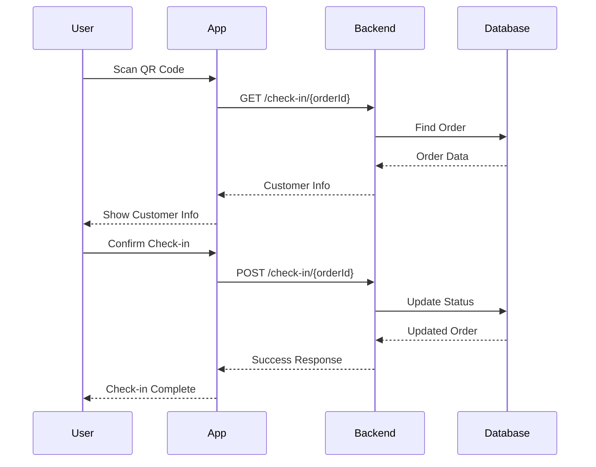

# 🔌 API Endpoints Summary for Frontend

## 🌍 **Environment URLs**

```typescript
// .env
NUXT_PUBLIC_API_BASE_URL=http://localhost:3001  // Development
NUXT_PUBLIC_APP_URL=http://localhost:3000       // Frontend URL

// Production
NUXT_PUBLIC_API_BASE_URL=http://43.229.133.51:3001
NUXT_PUBLIC_APP_URL=http://43.229.133.51:3000
```

---

## 🔐 **Authentication Endpoints**

### **Staff/Admin Login (for Web)**
```typescript
POST /api/mobile-scanner/staff-login
Content-Type: application/json

{
  "username": "staff1",
  "password": "staff123"
}

// Response
{
  "success": true,
  "message": "Login successful",
  "user": {
    "username": "staff1",
    "role": "staff",
    "name": "Staff Member 1"
  },
  "token": "eyJhbGciOiJIUzI1NiIsInR5cCI6IkpXVCJ9..."
}
```

### **Mobile App Login (JWT)**
```typescript
POST /api/auth/login
Content-Type: application/json

{
  "username": "mobile_user",
  "password": "password123"
}

// Response
{
  "access_token": "eyJhbGciOiJIUzI1NiIsInR5cCI6IkpXVCJ9...",
  "user": {
    "id": 1,
    "username": "mobile_user",
    "role": "staff"
  }
}
```

---

## 📱 **QR Code Scanning Endpoints**

### **1. Public Customer Info (for QR Scan)**
```typescript
GET /api/mobile-scanner/check-in/{orderId}

// Response - Customer Info Display
{
  "success": true,
  "customer": {
    "orderId": "ORD001",
    "customerName": "John Doe",
    "phone": "0812345678",
    "seatNumber": "A1",
    "ticketType": "VIP",
    "eventName": "Concert 2025",
    "eventDate": "2025-01-15T19:00:00Z",
    "attendanceStatus": "PENDING"
  },
  "canCheckIn": true,
  "message": "Ready for check-in"
}
```

### **2. Staff Check-in (Web Form)**
```typescript
POST /api/mobile-scanner/check-in/{orderId}
Content-Type: application/json

{
  "username": "staff1",
  "password": "staff123"
}

// Response - HTML Page
Content-Type: text/html

<!DOCTYPE html>
<html>
<head>
    <title>Check-in Success</title>
    <meta name="viewport" content="width=device-width, initial-scale=1.0">
</head>
<body>
    <div class="container">
        <div class="success">
            <h2>✅ Check-in Successful!</h2>
            <p><strong>Customer:</strong> John Doe</p>
            <p><strong>Order:</strong> ORD001</p>
            <p><strong>Seat:</strong> A1</p>
            <p><strong>Time:</strong> 15/01/2025 19:30:45</p>
        </div>
    </div>
</body>
</html>
```

### **3. Mobile App Scan (JWT Protected)**
```typescript
POST /api/mobile-scanner/scan
Authorization: Bearer {token}
Content-Type: application/json

{
  "qrData": "base64_encoded_qr_data"
}

// Response
{
  "success": true,
  "message": "Check-in completed successfully",
  "order": {
    "orderId": "ORD001",
    "customerName": "John Doe",
    "attendanceStatus": "CHECKED_IN",
    "checkedInAt": "2025-01-15T19:30:45Z",
    "checkedInBy": "staff1"
  }
}
```

---

## 📊 **Analytics & Reports**

### **Scan History**
```typescript
GET /api/mobile-scanner/history
Authorization: Bearer {token}
Query Parameters:
- date: 'today' | 'week' | 'month'
- status: 'all' | 'success' | 'error'
- limit: number
- offset: number

// Response
{
  "success": true,
  "data": [
    {
      "id": 1,
      "orderId": "ORD001",
      "customerName": "John Doe",
      "scannedAt": "2025-01-15T19:30:45Z",
      "scannedBy": "staff1",
      "success": true,
      "previousStatus": "PENDING",
      "newStatus": "CHECKED_IN"
    }
  ],
  "pagination": {
    "total": 150,
    "page": 1,
    "limit": 20,
    "totalPages": 8
  }
}
```

### **Dashboard Stats**
```typescript
GET /api/mobile-scanner/stats
Authorization: Bearer {token}

// Response
{
  "success": true,
  "stats": {
    "totalScans": 150,
    "successfulScans": 147,
    "failedScans": 3,
    "todayScans": 25,
    "activeStaff": 3,
    "peakHour": "19:00-20:00"
  }
}
```

---

## ⚠️ **Error Handling**

### **Common Error Responses**
```typescript
// Authentication Error
{
  "success": false,
  "error": "UNAUTHORIZED",
  "message": "Invalid credentials",
  "statusCode": 401
}

// Order Not Found
{
  "success": false,
  "error": "ORDER_NOT_FOUND",
  "message": "Order not found",
  "statusCode": 404
}

// Already Checked In
{
  "success": false,
  "error": "ALREADY_CHECKED_IN",
  "message": "Customer already checked in",
  "statusCode": 400,
  "data": {
    "checkedInAt": "2025-01-15T18:00:00Z",
    "checkedInBy": "staff2"
  }
}

// Invalid QR Code
{
  "success": false,
  "error": "INVALID_QR_CODE",
  "message": "QR code is invalid or expired",
  "statusCode": 400
}

// Server Error
{
  "success": false,
  "error": "INTERNAL_ERROR",
  "message": "An internal error occurred",
  "statusCode": 500
}
```

---

## 🛠️ **Frontend Implementation**

### **1. API Service (Composable)**
```typescript
// composables/useAPI.ts
export const useAPI = () => {
  const config = useRuntimeConfig()
  const baseURL = config.public.apiBaseUrl

  const apiCall = async (endpoint: string, options: any = {}) => {
    const token = useCookie('auth-token')
    
    const defaultOptions = {
      baseURL,
      headers: {
        'Content-Type': 'application/json',
        ...(token.value && { Authorization: `Bearer ${token.value}` })
      }
    }

    try {
      const response = await $fetch(endpoint, {
        ...defaultOptions,
        ...options
      })
      return response
    } catch (error) {
      throw createError({
        statusCode: error.statusCode || 500,
        statusMessage: error.data?.message || 'API Error'
      })
    }
  }

  return { apiCall }
}
```

### **2. Auth Composable**
```typescript
// composables/useAuth.ts
export const useAuth = () => {
  const token = useCookie('auth-token')
  const user = useState('auth.user', () => null)

  const login = async (credentials: { username: string, password: string }) => {
    const { apiCall } = useAPI()
    
    const response = await apiCall('/mobile-scanner/staff-login', {
      method: 'POST',
      body: credentials
    })

    if (response.success) {
      token.value = response.token
      user.value = response.user
      return response
    }
    
    throw new Error(response.message || 'Login failed')
  }

  const logout = async () => {
    token.value = null
    user.value = null
    await navigateTo('/mobile/login')
  }

  const isAuthenticated = computed(() => !!token.value)

  return {
    user: readonly(user),
    login,
    logout,
    isAuthenticated
  }
}
```

### **3. QR Scanner Composable**
```typescript
// composables/useQRScanner.ts
export const useQRScanner = () => {
  const { apiCall } = useAPI()

  const scanQRCode = async (qrData: string) => {
    return await apiCall('/mobile-scanner/scan', {
      method: 'POST',
      body: { qrData }
    })
  }

  const getCustomerInfo = async (orderId: string) => {
    return await apiCall(`/mobile-scanner/check-in/${orderId}`)
  }

  const checkInCustomer = async (orderId: string, credentials: any) => {
    return await apiCall(`/mobile-scanner/check-in/${orderId}`, {
      method: 'POST',
      body: credentials
    })
  }

  return {
    scanQRCode,
    getCustomerInfo,
    checkInCustomer
  }
}
```

### **4. Scan History Composable**
```typescript
// composables/useScanHistory.ts
export const useScanHistory = () => {
  const { apiCall } = useAPI()
  const scanHistory = ref([])

  const fetchHistory = async (filters: any = {}) => {
    const response = await apiCall('/mobile-scanner/history', {
      query: filters
    })
    
    scanHistory.value = response.data
    return response
  }

  const getStats = async () => {
    return await apiCall('/mobile-scanner/stats')
  }

  return {
    scanHistory: readonly(scanHistory),
    fetchHistory,
    getStats
  }
}
```

---

## 🔄 **Request/Response Flow**

### **QR Code Scan Flow:**


---

## 🧪 **Testing Endpoints**

### **cURL Examples:**

```bash
# 1. Staff Login
curl -X POST http://localhost:3001/api/mobile-scanner/staff-login \
  -H "Content-Type: application/json" \
  -d '{"username":"staff1","password":"staff123"}'

# 2. Get Customer Info
curl -X GET http://localhost:3001/api/mobile-scanner/check-in/ORD001

# 3. Check-in Customer
curl -X POST http://localhost:3001/api/mobile-scanner/check-in/ORD001 \
  -H "Content-Type: application/json" \
  -d '{"username":"staff1","password":"staff123"}'

# 4. Mobile App Scan (with JWT)
curl -X POST http://localhost:3001/api/mobile-scanner/scan \
  -H "Authorization: Bearer YOUR_JWT_TOKEN" \
  -H "Content-Type: application/json" \
  -d '{"qrData":"base64_encoded_data"}'
```

---

**🎯 API Summary:**
- **Public:** Customer info display (`GET /check-in/{orderId}`)
- **Web Auth:** Staff login + check-in (`POST /check-in/{orderId}`)
- **Mobile Auth:** JWT-based scanning (`POST /scan`)
- **Analytics:** History & stats for reporting

**📱 Ready for Frontend Integration! 🚀**
