# 🔄 Auto-Deployment Setup Guide

## 🎯 **System Status**

✅ **Auto-deployment is READY!** 

เมื่อคุณ push code ไป GitHub จะมีการ deploy อัตโนมัติ

---

## 🔧 **How It Works**

### **1. GitHub Webhook → Auto Deploy**

```mermaid
graph LR
    A[📝 Git Push] --> B[🪝 GitHub Webhook]
    B --> C[🤖 Auto Deploy Script]
    C --> D[🏗️ Build & Deploy]
    D --> E[📱 Discord Notification]
```


### **2. Webhook Endpoints:**

| Endpoint | Purpose | Usage |
|----------|---------|-------|
| `/webhook/deploy` | 🤖 **Auto Deploy** | GitHub webhook calls this |
| `/webhook/v1/deploy` | 📱 **Notifications** | Manual deployment notifications |

---

## ⚙️ **Configuration Needed**

### **🔗 GitHub Webhook Setup:**

1. **Go to your GitHub repository**
2. **Settings → Webhooks → Add webhook**
3. **Configure:**
   ```
   Payload URL: http://43.229.133.51:4000/api/webhook/deploy
   Content type: application/json
   Secret: (optional - currently disabled)
   Events: Just the push event
   Active: ✅ checked
   ```

### **🎯 Branch Filter:**
- Currently set to auto-deploy only from: `feature/newfunction`
- Change in `/src/webhook/webhook.controller.ts` line ~104

---

## 📁 **Files Created/Updated:**

### ✅ **Auto-Deploy Script:**
- **File:** `scripts/webhook-deploy.sh`
- **Purpose:** Automatically deploy when GitHub webhook triggers
- **Features:**
  - Pull latest code
  - Install dependencies  
  - Build application
  - Restart PM2
  - Send Discord notifications
  - Health check verification

### ✅ **Webhook Controller:**
- **File:** `src/webhook/webhook.controller.ts`
- **Endpoints:**
  - `POST /webhook/deploy` - GitHub auto-deploy
  - `POST /webhook/v1/deploy` - Manual notifications
- **Features:**
  - GitHub payload validation
  - Branch filtering
  - Discord integration
  - Background deployment execution

---

## 🧪 **Testing Auto-Deploy**

### **Test Webhook (Without GitHub):**
```bash
# Test the webhook endpoint
curl -X POST http://43.229.133.51:4000/api/webhook/deploy \
  -H "Content-Type: application/json" \
  -H "User-Agent: GitHub-Hookshot/test" \
  -d '{
    "repository": {
      "name": "ticket-backend"  
    },
    "ref": "refs/heads/feature/newfunction",
    "commits": [
      {
        "id": "test123",
        "message": "Test auto deploy"
      }
    ]
  }'
```

### **Test with Real Push:**
1. Make a small change to any file
2. Commit and push to `feature/newfunction` branch
3. Check Discord for notifications
4. Verify deployment in PM2: `pm2 status`

---

## 📱 **Discord Notifications**

### **Auto-Deploy Messages:**
- 🤖 **Started:** "Auto-deployment initiated from GitHub webhook"
- ✅ **Success:** "Auto-deployment completed successfully!"
- ❌ **Failed:** "Auto-deployment failed: [reason]"
- ⚠️ **Warning:** "Deployment completed but health check failed"

### **Notification Features:**
- Color-coded by status (Green/Red/Yellow)
- Shows branch, commit hash, timestamp
- Links to health check results
- Distinguishes auto vs manual deployments

---

## 🛠️ **Manual Operations**

### **Force Deploy (Manual):**
```bash
# Run deployment script manually
cd /var/www/ticket-backend
./scripts/webhook-deploy.sh
```

### **Check Deployment Status:**
```bash
# Check PM2 status
pm2 status

# Check logs
pm2 logs ticket-backend-prod

# Check health
curl http://localhost:3001/api/health
```

### **Rollback if Needed:**
```bash
# Stop current deployment
pm2 stop ticket-backend-prod

# Go back to previous commit
git checkout [previous-commit-hash]

# Rebuild and restart
npm run build
pm2 restart ticket-backend-prod
```

---

## ⚠️ **Important Notes**

### **Environment Assumptions:**
- **Project Path:** `/var/www/ticket-backend`
- **Branch:** `feature/newfunction`
- **PM2 App Name:** `ticket-backend-prod`
- **Port:** `3001` (internal), `4000` (external)

### **Security:**
- Webhook signature validation is currently **DISABLED**
- Only `feature/newfunction` branch triggers deploy
- User-Agent validation for GitHub requests

### **Dependencies:**
- ✅ Git repository setup
- ✅ Node.js & npm installed
- ✅ PM2 process manager
- ✅ Internet access for GitHub/Discord

---

## 🚨 **Troubleshooting**

### **If Auto-Deploy Fails:**

1. **Check webhook logs:**
   ```bash
   pm2 logs ticket-backend-prod | grep "AUTO-DEPLOY"
   ```

2. **Check GitHub webhook deliveries:**
   - Go to GitHub → Settings → Webhooks
   - Check "Recent Deliveries" tab
   - Look for failed deliveries

3. **Manual test:**
   ```bash
   cd /var/www/ticket-backend
   ./scripts/webhook-deploy.sh
   ```

4. **Check Discord:** Should see notifications if working

---

## 🎯 **Summary**

**✅ Auto-deployment is SET UP and READY!**

**To activate:**
1. Add GitHub webhook: `http://43.229.133.51:4000/api/webhook/deploy`
2. Push code to `feature/newfunction` branch
3. Watch Discord for deployment notifications
4. Verify with `pm2 status`

**Flow:**
`Git Push` → `GitHub Webhook` → `Auto Deploy` → `Discord Notification` → `✅ Done!`

**🚀 Your code will now deploy automatically on every push! 🎉**
