# 📋 Frontend Development Master Guide

## 🎯 **Project Overview**
> Stadium QR Check-in System with secure staff authentication and mobile app integration

---

## 📚 **Documentation Index**

| 📄 Document | 🎯 Purpose | 👥 Target Audience |
|-------------|------------|-------------------|
| **[QR_CODE_SYSTEM_FLOW.md](./QR_CODE_SYSTEM_FLOW.md)** | System Architecture & Flow | All Developers |
| **[FRONTEND_ROUTES_GUIDE.md](./FRONTEND_ROUTES_GUIDE.md)** | Pages & Navigation | Frontend Team |
| **[API_ENDPOINTS_SUMMARY.md](./API_ENDPOINTS_SUMMARY.md)** | API Integration | Frontend Team |
| **[QR_CODE_API_REFERENCE.md](./QR_CODE_API_REFERENCE.md)** | Complete API Docs | All Developers |
| **[STAFF_CREDENTIALS_TESTING.md](./STAFF_CREDENTIALS_TESTING.md)** | Testing Guide | QA Team |
| **[FRONTEND_IMPLEMENTATION_GUIDE.md](./FRONTEND_IMPLEMENTATION_GUIDE.md)** | Step-by-step Setup | Frontend Team |
| **[ENVIRONMENT_CONFIGURATION.md](./ENVIRONMENT_CONFIGURATION.md)** | Environment Setup | DevOps Team |

---

## 🚀 **Quick Start for Frontend Team**

### **1. Environment Setup**
```bash
# Clone and setup frontend
git clone [frontend-repo]
cd [frontend-project]

# Install dependencies
npm install

# Setup environment
cp .env.example .env
```

### **2. Environment Variables**
```env
# Development
NUXT_PUBLIC_API_BASE_URL=http://localhost:3001
NUXT_PUBLIC_APP_URL=http://localhost:3000

# Production  
NUXT_PUBLIC_API_BASE_URL=http://43.229.133.51:3001
NUXT_PUBLIC_APP_URL=http://43.229.133.51:3000
```

### **3. Required Pages**
- `/` - Landing page
- `/mobile/login` - Staff authentication
- `/mobile/scanner` - QR code scanner
- `/mobile/history` - Scan history

### **4. Core APIs**
- `GET /api/mobile-scanner/check-in/{orderId}` - Customer info
- `POST /api/mobile-scanner/check-in/{orderId}` - Staff check-in
- `POST /api/mobile-scanner/scan` - Mobile app scan

---

## 📱 **Implementation Priorities**

### **Phase 1: Core Functionality (Week 1)**
- [ ] Staff login page (`/mobile/login`)
- [ ] QR scanner page (`/mobile/scanner`) 
- [ ] Customer info display
- [ ] Check-in confirmation

### **Phase 2: Enhanced Features (Week 2)**
- [ ] Scan history page (`/mobile/history`)
- [ ] Offline mode support
- [ ] Error handling & validation
- [ ] Mobile responsive design

### **Phase 3: Advanced Features (Week 3)**
- [ ] Real-time notifications
- [ ] Analytics dashboard
- [ ] Performance optimization
- [ ] PWA capabilities

---

## 🔐 **Security Implementation**

### **Authentication Layers:**
1. **Web Staff Login** - Username/Password → HTML response
2. **Mobile App** - JWT Authentication → JSON response
3. **Public Info** - No auth required → Customer display only

### **Authorization Flow:**
```typescript
// Anyone can view customer info
GET /check-in/{orderId} // Public

// Only staff can check-in
POST /check-in/{orderId} // Requires credentials

// Mobile app scanning
POST /scan // Requires JWT token
```

---

## 🧪 **Testing Strategy**

### **Test Credentials:**
```javascript
const testCredentials = [
  { username: 'staff1', password: 'staff123', role: 'staff' },
  { username: 'staff2', password: 'staff456', role: 'staff' },
  { username: 'admin', password: 'admin123', role: 'admin' }
]
```

### **Test Scenarios:**
1. **QR Scan Flow** - End-to-end customer check-in
2. **Authentication** - Staff login validation  
3. **Error Handling** - Invalid QR codes, duplicate check-ins
4. **Mobile Compatibility** - Various QR scanner apps

---

## 🎨 **UI/UX Guidelines**

### **Design Principles:**
- **Mobile-First** - Primary interface is mobile
- **Accessibility** - Screen reader friendly
- **Offline Support** - Works without internet
- **Fast Scanning** - Instant QR recognition

### **Key Components:**
```typescript
// Required Components
- QRScanner        // Camera-based scanning
- ScanResultModal  // Check-in confirmation
- CustomerInfo     // Order details display
- StaffLogin       // Authentication form
- ScanHistory      // Activity log
```

---

## 🔧 **Technical Stack**

### **Frontend Requirements:**
- **Framework:** Nuxt 3 + Vue 3
- **QR Scanner:** `@zxing/browser` or similar
- **Camera:** Web Camera API
- **State:** Pinia or built-in state
- **UI:** Tailwind CSS or Vuetify

### **API Integration:**
```typescript
// Core composables needed
useAuth()       // Authentication management
useQRScanner()  // QR code functionality  
useAPI()        // HTTP client wrapper
useScanHistory() // Activity tracking
```

---

## 📊 **Data Flow**

### **QR Code → Check-in Process:**

```mermaid
graph LR
    A[📱 Scan QR] --> B[🔍 Parse URL]
    B --> C[📡 GET Customer Info]
    C --> D[👤 Show Details]
    D --> E[🔐 Staff Login]
    E --> F[✅ Check-in API]
    F --> G[📄 Success Page]
```


### **State Management:**
```typescript
interface AppState {
  auth: {
    user: User | null
    token: string | null
    isAuthenticated: boolean
  }
  scanner: {
    isScanning: boolean
    lastResult: ScanResult | null
    history: ScanRecord[]
  }
  ui: {
    loading: boolean
    error: string | null
    currentPage: string
  }
}
```

---

## 🌐 **Deployment Checklist**

### **Pre-Deploy Verification:**
- [ ] Environment variables configured
- [ ] API endpoints tested
- [ ] QR codes generate correctly
- [ ] Staff credentials working
- [ ] Mobile responsive design
- [ ] Cross-browser compatibility

### **Production URLs:**
### **Production URLs:**
### **Production URLs:**
### **Production URLs:**
```bash
# Frontend
https://43.229.133.51:3000

# API Backend  
https://43.229.133.51:3001/api

# Health Check
https://43.229.133.51:3001/api/health
```

---

## 🐛 **Troubleshooting**

### **Common Issues:**

| 🚨 Issue | ✅ Solution |
|----------|-------------|
| QR codes not scanning | Check camera permissions |
| API calls failing | Verify CORS configuration |
| Login not working | Test with provided credentials |
| 404 errors | Check route configuration |
| Mobile camera issues | Test on physical device |

### **Debug Commands:**
```bash
# Check API health
curl http://localhost:3001/api/health

# Test staff login
curl -X POST http://localhost:3001/api/mobile-scanner/staff-login \
  -d '{"username":"staff1","password":"staff123"}'

# Verify QR endpoint
curl http://localhost:3001/api/mobile-scanner/check-in/ORD001
```

---

## 📞 **Support & Resources**

### **Backend Team Contact:**
- API Documentation: `/api/docs`
- Health Check: `/api/health`  
- Error Logs: Check server console

### **Testing Resources:**
- Test QR codes available in backend
- Staff credentials in testing guide
- Postman collection for API testing

---

## 🎯 **Success Criteria**

### **Acceptance Requirements:**
✅ **Functional:**
- Staff can scan QR codes successfully
- Customer info displays correctly  
- Check-in updates attendance status
- Authentication prevents unauthorized access

✅ **Technical:**
- Works on iOS/Android browsers
- Compatible with popular QR apps
- Responsive design for all screen sizes
- Fast load times (< 3 seconds)

✅ **User Experience:**
- Intuitive scan interface
- Clear success/error feedback
- Minimal steps to complete check-in
- Offline mode for poor connectivity

---

**🎉 Ready to Build! Frontend team has everything needed to implement the complete QR check-in system. 🚀**

> **Next Steps:** Start with Phase 1 implementation using the provided routes, APIs, and documentation. Reach out for any clarifications! 💪
