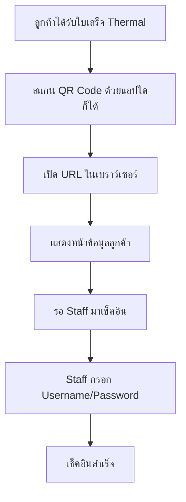
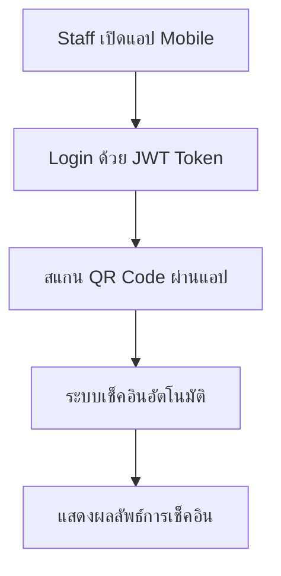

# 📱 QR Code System Integration Guide for Frontend

## 📋 **ภาพรวมระบบ**

ระบบ QR Code ใหม่ที่รองรับการสแกนจากแอปทั่วไป (กล้องมือถือ, LINE, แอปสแกน QR Code อื่นๆ) และมีการควบคุมการเช็คอินผ่าน Staff/Admin เท่านั้น

---

## 🔄 **User Flow**

### **สำหรับลูกค้า (Customer)**


### **สำหรับ Staff (Mobile App)**


---

## 🚀 **API Endpoints สำหรับ Frontend**

### **1. Public QR Code Handler (ไม่ต้อง Authentication)**
```http
GET /api/v1/mobile/scanner/check-in/{orderId}?qr={encrypted_data}
Content-Type: text/html
```

**ตัวอย่าง URL ที่ QR Code จะสร้าง:**
```
https://your-domain.com/api/v1/mobile/scanner/check-in/ORD-20250811-001?qr=U2FsdGVkX1%2B...
```

**Response:** HTML Page แสดงข้อมูลลูกค้าและฟอร์ม Staff Login

---

### **2. Staff Check-in via Web Form (ไม่ต้อง Authentication)**
```http
POST /api/v1/mobile/scanner/staff-checkin
Content-Type: application/json
```

**Request Body:**
```json
{
  "orderId": "ORD-20250811-001",
  "qrData": "encrypted_qr_data",
  "username": "staff1",
  "password": "staff123"
}
```

**Response:** HTML Page แสดงผลการเช็คอิน

---

### **3. Mobile App Scan (ต้องมี JWT Token)**
```http
POST /api/v1/mobile/scanner/scan
Authorization: Bearer {jwt_token}
Content-Type: application/json
```

**Request Body:**
```json
{
  "qrData": "encrypted_qr_data",
  "location": "Stadium Gate",
  "deviceId": "mobile_device_123"
}
```

**Response:**
```json
{
  "success": true,
  "data": {
    "orderId": "ORD-20250811-001",
    "isValid": true,
    "attendanceStatus": "CHECKED_IN",
    "customerName": "John Doe",
    "customerPhone": "081-234-5678",
    "ticketType": "seated",
    "seats": ["A1", "A2"],
    "checkInTime": "2025-08-12T14:30:00.000Z"
  },
  "message": "เช็คอินสำเร็จ",
  "timestamp": "2025-08-12T14:30:00.000Z"
}
```

---

## 🎨 **Frontend Components ที่ต้องทำ**

### **1. QR Code Scanner (Mobile App)**
```typescript
// components/QRScanner.vue
<template>
  <div class="qr-scanner">
    <camera-scanner @scan="handleScan" />
    <div v-if="scanning" class="scanning-overlay">
      <p>กำลังสแกน QR Code...</p>
    </div>
  </div>
</template>

<script setup>
import { ref } from 'vue'
import { useQRScannerStore } from '@/stores/qrScanner'

const qrStore = useQRScannerStore()
const scanning = ref(false)

const handleScan = async (qrData: string) => {
  scanning.value = true
  try {
    const result = await qrStore.scanQRCode(qrData)
    // แสดงผลลัพธ์
    showScanResult(result)
  } catch (error) {
    showError(error.message)
  } finally {
    scanning.value = false
  }
}
</script>
```

### **2. QR Scanner Store (Pinia)**
```typescript
// stores/qrScanner.ts
import { defineStore } from 'pinia'
import { useAuthStore } from './auth'

export const useQRScannerStore = defineStore('qrScanner', {
  state: () => ({
    scanHistory: [],
    isScanning: false
  }),

  actions: {
    async scanQRCode(qrData: string) {
      const authStore = useAuthStore()
      
      const response = await $fetch('/api/v1/mobile/scanner/scan', {
        method: 'POST',
        headers: {
          'Authorization': `Bearer ${authStore.token}`,
          'Content-Type': 'application/json'
        },
        body: {
          qrData,
          location: 'Stadium Gate',
          deviceId: getDeviceId()
        }
      })

      // บันทึกประวัติการสแกน
      this.scanHistory.unshift({
        ...response.data,
        timestamp: new Date()
      })

      return response
    }
  }
})
```

### **3. Scan Result Component**
```typescript
// components/ScanResult.vue
<template>
  <div class="scan-result">
    <div class="result-header" :class="statusClass">
      <Icon :name="statusIcon" size="48" />
      <h2>{{ result.message }}</h2>
    </div>

    <div class="customer-info">
      <h3>ข้อมูลลูกค้า</h3>
      <div class="info-grid">
        <div class="info-item">
          <span class="label">Order ID:</span>
          <span class="value">{{ result.data.orderId }}</span>
        </div>
        <div class="info-item">
          <span class="label">ชื่อลูกค้า:</span>
          <span class="value">{{ result.data.customerName }}</span>
        </div>
        <div class="info-item">
          <span class="label">โทรศัพท์:</span>
          <span class="value">{{ result.data.customerPhone }}</span>
        </div>
        <div class="info-item">
          <span class="label">ที่นั่ง:</span>
          <span class="value">{{ result.data.seats?.join(', ') || 'N/A' }}</span>
        </div>
        <div class="info-item">
          <span class="label">เวลาเช็คอิน:</span>
          <span class="value">{{ formatDateTime(result.data.checkInTime) }}</span>
        </div>
      </div>
    </div>

    <div class="actions">
      <button @click="scanNext" class="btn-primary">
        สแกนคิวต่อไป
      </button>
      <button @click="viewHistory" class="btn-secondary">
        ดูประวัติการสแกน
      </button>
    </div>
  </div>
</template>
```

---

## 🛠️ **Technical Requirements**

### **Frontend Framework:**
- **Nuxt 3** + **Vue 3** + **TypeScript**
- **Pinia** สำหรับ State Management
- **Tailwind CSS** สำหรับ Styling

### **QR Code Scanning Libraries:**
```bash
# สำหรับ Mobile App
npm install @zxing/library
npm install qr-scanner

# สำหรับ Web Camera
npm install jsqr
npm install html5-qrcode
```

### **Camera Permissions:**
```typescript
// utils/camera.ts
export const requestCameraPermission = async () => {
  try {
    const stream = await navigator.mediaDevices.getUserMedia({ 
      video: { facingMode: 'environment' } 
    })
    return stream
  } catch (error) {
    throw new Error('กรุณาอนุญาตการใช้งานกล้อง')
  }
}
```

---

## 📱 **Mobile App Screens**

### **1. Scanner Screen**
```
┌─────────────────────────┐
│     🔍 QR Scanner       │
├─────────────────────────┤
│                         │
│    ┌─────────────┐      │
│    │   Camera    │      │
│    │   Preview   │      │
│    │      📷     │      │
│    └─────────────┘      │
│                         │
│  "จ่อ QR Code ที่กล้อง"   │
│                         │
│ [💡] [📊 ประวัติ] [⚙️]    │
└─────────────────────────┘
```

### **2. Scan Result Screen**
```
┌─────────────────────────┐
│   ✅ เช็คอินสำเร็จ        │
├─────────────────────────┤
│                         │
│  📋 ข้อมูลลูกค้า          │
│  ─────────────────      │
│  Order: ORD-001         │
│  ชื่อ: John Doe         │
│  โทร: 081-234-5678      │
│  ที่นั่ง: A1, A2        │
│  เวลา: 14:30            │
│                         │
│  [ สแกนคิวต่อไป ]        │
│  [ ดูประวัติ ]           │
└─────────────────────────┘
```

---

## 🌐 **Web Interface (Customer View)**

### **QR Code Landing Page:**
```html
<!-- ตัวอย่าง HTML ที่ Backend จะ render -->
<div class="customer-info-page">
  <div class="header">
    <h1>📋 ข้อมูลลูกค้า</h1>
    <p>Order: ORD-20250811-001</p>
  </div>

  <div class="customer-details">
    <h3>ข้อมูลลูกค้า</h3>
    <div class="info-grid">
      <div>ชื่อ: John Doe</div>
      <div>โทรศัพท์: 081-234-5678</div>
      <div>ที่นั่ง: A1, A2</div>
      <div>ราคา: 3,000 บาท</div>
      <div>สถานะ: ⏳ รอเช็คอิน</div>
    </div>
  </div>

  <!-- Staff Login Form -->
  <form id="staffLoginForm">
    <h3>🔐 เจ้าหน้าที่เช็คอิน</h3>
    <input type="text" name="username" placeholder="Username" required>
    <input type="password" name="password" placeholder="Password" required>
    <button type="submit">เข้าสู่ระบบและเช็คอิน</button>
  </form>
</div>
```

---

## 🔧 **Configuration**

### **Environment Variables:**
```bash
# .env
NUXT_PUBLIC_API_BASE_URL=https://your-domain.com
NUXT_PUBLIC_QR_SCAN_TIMEOUT=30000
NUXT_PUBLIC_CAMERA_FACING_MODE=environment
```

### **Nuxt Config:**
```typescript
// nuxt.config.ts
export default defineNuxtConfig({
  modules: [
    '@pinia/nuxt',
    '@nuxtjs/tailwindcss'
  ],
  
  runtimeConfig: {
    public: {
      apiBaseUrl: process.env.NUXT_PUBLIC_API_BASE_URL,
      qrScanTimeout: process.env.NUXT_PUBLIC_QR_SCAN_TIMEOUT
    }
  },

  // PWA สำหรับ Mobile App
  pwa: {
    manifest: {
      name: 'Stadium Check-in App',
      short_name: 'Stadium App',
      theme_color: '#3B82F6'
    }
  }
})
```

---

## 🔒 **Authentication Flow**

### **Staff Login (Mobile App):**
```typescript
// stores/auth.ts
export const useAuthStore = defineStore('auth', {
  state: () => ({
    user: null,
    token: null,
    isAuthenticated: false
  }),

  actions: {
    async login(username: string, password: string) {
      const response = await $fetch('/api/v1/auth/login', {
        method: 'POST',
        body: { username, password }
      })

      this.token = response.token
      this.user = response.user
      this.isAuthenticated = true

      // เก็บ token ใน localStorage
      localStorage.setItem('auth_token', response.token)
    },

    async logout() {
      this.token = null
      this.user = null
      this.isAuthenticated = false
      localStorage.removeItem('auth_token')
    }
  }
})
```

---

## 📊 **Data Models**

### **QR Scan Result:**
```typescript
interface QRScanResult {
  success: boolean
  data: {
    orderId: string
    isValid: boolean
    attendanceStatus: 'PENDING' | 'CHECKED_IN'
    customerName: string
    customerPhone?: string
    ticketType: 'seated' | 'standing'
    seats?: string[]
    checkInTime: string
  }
  message: string
  timestamp: string
}
```

### **Staff Credentials:**
```typescript
interface StaffCredentials {
  username: string
  password: string
}

// ตัวอย่าง credentials ที่ Backend รองรับ
const VALID_CREDENTIALS = [
  { username: 'staff1', password: 'staff123' },
  { username: 'staff2', password: 'staff456' },
  { username: 'admin', password: 'admin123' }
]
```

---

## 🎯 **Implementation Steps**

### **Phase 1: Basic QR Scanner (Mobile App)**
1. ✅ Setup Nuxt 3 + TypeScript + Pinia
2. ✅ Install QR Scanner libraries
3. ✅ Create Camera component
4. ✅ Implement QR Code scanning
5. ✅ Create API integration

### **Phase 2: Staff Authentication**
1. ✅ Create Login screen
2. ✅ Implement JWT token handling
3. ✅ Add role-based access control
4. ✅ Create Staff dashboard

### **Phase 3: Enhanced UX**
1. ✅ Add scan history
2. ✅ Implement offline mode
3. ✅ Add push notifications
4. ✅ Create analytics dashboard

---

## 🚨 **Error Handling**

### **Common Errors:**
```typescript
// utils/errorHandling.ts
export const QR_ERRORS = {
  INVALID_QR: 'QR Code ไม่ถูกต้องหรือเสียหาย',
  EXPIRED_QR: 'QR Code หมดอายุแล้ว',
  INVALID_CREDENTIALS: 'Username หรือ Password ไม่ถูกต้อง',
  ALREADY_CHECKED_IN: 'ลูกค้าได้เช็คอินแล้ว',
  NETWORK_ERROR: 'ไม่สามารถเชื่อมต่อเซิร์ฟเวอร์ได้',
  CAMERA_PERMISSION: 'กรุณาอนุญาตการใช้งานกล้อง'
}
```

---

## 📞 **Support & Contact**

- **Backend API Documentation:** `/api/docs` (Swagger)
- **Technical Issues:** สอบถาม Backend Team
- **QR Code Format:** ดูใน `QRCodeService.generateTicketQR()`

---

**🎉 Happy Coding! Frontend Team! 🚀**
