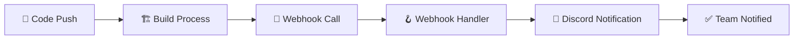

# 🪝 Webhook Deployment Guide

## 🎯 **Overview**
ระบบ Webhook สำหรับรับการแจ้งเตือน deployment และส่งต่อไป Discord channel

---

## 🔗 **Webhook Endpoints**

### **Production URL:**
```
http://43.229.133.51:4000/api/v1/webhook/deploy
```

### **Local Development:**
```
http://localhost:3001/api/webhook/v1/deploy
```

---

## 📡 **API Reference**

### **POST `/api/v1/webhook/deploy`**
รับการแจ้งเตือน deployment และส่งต่อไป Discord

**Request Body:**
```json
{
  "status": "success",
  "message": "Deployment completed successfully",
  "branch": "feature/newfunction",
  "commit": "abc1234567890",
  "timestamp": "2025-01-15T10:30:00.000Z",
  "environment": "production",
  "version": "1.0.0"
}
```

**Response:**
```json
{
  "success": true,
  "message": "Deployment notification processed",
  "timestamp": "2025-01-15T10:30:00.000Z"
}
```

---

## 🎨 **Status Types & Discord Colors**

| Status | Color | Emoji | Description |
|--------|-------|-------|-------------|
| `success` | 🟢 Green | ✅ | Deployment completed successfully |
| `failed` | 🔴 Red | ❌ | Deployment failed |
| `started` | 🔵 Blue | 🚀 | Deployment started |
| `deploying` | 🔵 Blue | 🚀 | Deployment in progress |
| `warning` | 🟡 Yellow | ⚠️ | Deployment with warnings |

---

## 🛠️ **Integration with Build Script**

### **Updated `build-and-deploy.sh`:**
```bash
# Webhook notification URL
WEBHOOK_URL="http://43.229.133.51:4000/api/v1/webhook/deploy"

# Function to send webhook notification
send_webhook_notification() {
    local status="$1"
    local message="$2"
    local branch=$(git branch --show-current 2>/dev/null || echo 'unknown')
    local commit=$(git rev-parse HEAD 2>/dev/null || echo 'unknown')
    local timestamp=$(date -u +"%Y-%m-%dT%H:%M:%S.%3NZ")
    
    curl -H "Content-Type: application/json" \
         -X POST \
         -d "{
             \"status\": \"$status\",
             \"message\": \"$message\",
             \"branch\": \"$branch\",
             \"commit\": \"$commit\",
             \"timestamp\": \"$timestamp\",
             \"environment\": \"production\"
         }" \
         "$WEBHOOK_URL"
}

# Usage in deployment script
send_webhook_notification "started" "🚀 Starting deployment process..."
send_webhook_notification "success" "✅ Deployment completed successfully!"
```

---

## 📱 **Discord Integration**

### **Discord Channel:**
- **Webhook URL:** `https://discord.com/api/webhooks/1404715794205511752/H4H1Q-aJ2B1LwSpKxHYP7rt4tCWA0p10339NN5Gy71fhwXvFjcfSQKXNl9Xdj60ks__l`
- **Channel:** Stadium Backend Deployments

### **Discord Message Format:**
```json
{
  "embeds": [{
    "title": "🚀 Stadium Backend Deployment",
    "description": "Deployment completed successfully",
    "color": 5763719,
    "fields": [
      {
        "name": "📊 Status",
        "value": "SUCCESS",
        "inline": true
      },
      {
        "name": "🌿 Branch",
        "value": "feature/newfunction",
        "inline": true
      },
      {
        "name": "🌍 Environment",
        "value": "production",
        "inline": true
      },
      {
        "name": "⏰ Timestamp",
        "value": "15/01/2025 17:30:00",
        "inline": true
      }
    ],
    "footer": {
      "text": "Stadium Ticket System"
    }
  }]
}
```

---

## 🧪 **Testing**

### **Manual Testing:**
```bash
# Run test script
./scripts/test-webhook.sh

# Or test manually with curl
curl -X POST http://43.229.133.51:4000/api/v1/webhook/deploy \
  -H "Content-Type: application/json" \
  -d '{
    "status": "success",
    "message": "Test deployment notification",
    "branch": "feature/newfunction",
    "commit": "test123",
    "timestamp": "'$(date -u +"%Y-%m-%dT%H:%M:%S.%3NZ")'",
    "environment": "testing"
  }'
```

### **Expected Response:**
```json
{
  "success": true,
  "message": "Deployment notification processed",
  "timestamp": "2025-01-15T10:30:00.000Z"
}
```

---

## 🔧 **Deployment Flow**



### **Deployment Steps:**
1. **Code Push** → Repository updated
2. **Build Process** → `build-and-deploy.sh` runs
3. **Webhook Call** → Script calls webhook endpoint
4. **Webhook Handler** → NestJS processes notification
5. **Discord Notification** → Message sent to Discord
6. **Team Notified** → Team sees deployment status

---

## 📊 **Monitoring**

### **Webhook Logs:**
```bash
# Check webhook logs
pm2 logs ticket-backend-prod | grep "webhook"

# Check specific deployment notifications
pm2 logs ticket-backend-prod | grep "Deployment notification"
```

### **Health Check:**
```bash
# Test webhook endpoint
curl -X POST http://43.229.133.51:4000/api/webhook/test

# Expected response
{
  "status": "success", 
  "message": "Webhook endpoint is working"
}
```

---

## ⚠️ **Troubleshooting**

### **Common Issues:**

| 🚨 Issue | ✅ Solution |
|----------|-------------|
| Webhook not receiving notifications | Check URL in build script |
| Discord messages not appearing | Verify Discord webhook URL |
| 404 errors | Ensure endpoint path is correct |
| JSON parse errors | Validate request body format |

### **Debug Commands:**
```bash
# Test webhook endpoint
curl -v -X POST http://43.229.133.51:4000/api/v1/webhook/deploy \
  -H "Content-Type: application/json" \
  -d '{"status":"test","message":"debug"}'

# Check API health
curl http://43.229.133.51:4000/api/health

# View recent logs
pm2 logs ticket-backend-prod --lines 50
```

---

## 🔐 **Security Considerations**

### **Current Security:**
- ✅ Rate limiting on webhook endpoints
- ✅ Input validation for deployment data
- ✅ CORS configuration
- ⚠️ No authentication (public endpoint)

### **Future Enhancements:**
- 🔐 Webhook secret validation
- 🔒 IP whitelist for allowed sources
- 📝 Request logging and monitoring
- 🛡️ DDoS protection

---

## 📝 **Configuration**

### **Environment Variables:**
```env
# Discord webhook URL
DISCORD_WEBHOOK_URL=https://discord.com/api/webhooks/1404715794205511752/H4H1Q-aJ2B1LwSpKxHYP7rt4tCWA0p10339NN5Gy71fhwXvFjcfSQKXNl9Xdj60ks__l

# Optional: GitHub webhook secret
GITHUB_WEBHOOK_SECRET=your_secret_here
```

### **Port Configuration:**
- **Production:** `4000` (as specified in webhook URL)
- **Development:** `3001` (default NestJS port)

---

**🎯 Webhook System Ready!**
- ✅ Endpoint: `http://43.229.133.51:4000/api/v1/webhook/deploy`
- ✅ Discord integration configured
- ✅ Build script updated
- ✅ Testing script available

**🚀 Deploy และดู notifications ใน Discord channel! 📱**
